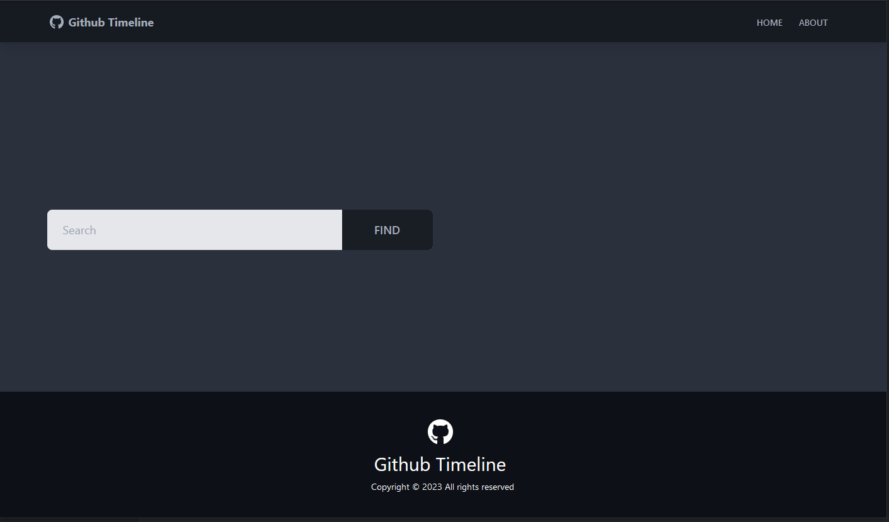

# Github-Timeline

Search GitHub profiles and see their repositories timeline

<div style="text-align:center">

</div>

## Install dependencies:

```bash
npm install
```

Create a .env file and add your API key to it:

```bash
REACT_APP_GITHUB_URL = "https://api.github.com"
REACT_APP_GITHUB_TOKEN ="ADD_YOUR_TOKEN"
```

## Run the dev server:

```bash
npm start
```
